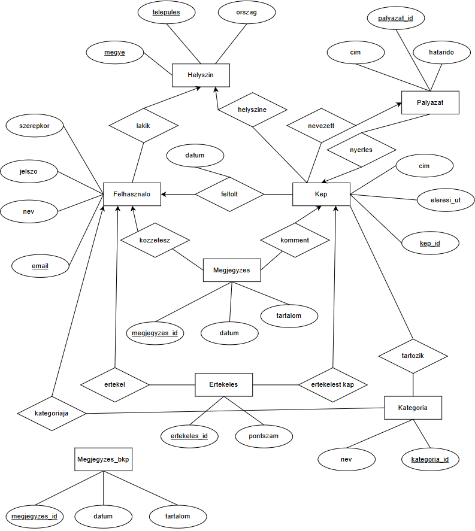

# Képalbumok adatmigrációs példa

## ETK diagram



## Postgres séma

```sql
CREATE TABLE Helyszin (
    telepules VARCHAR(255) NOT NULL,
    megye VARCHAR(255) NOT NULL,
    orszag VARCHAR(255) NOT NULL,
    PRIMARY KEY (megye, telepules)
);
CREATE TABLE Kategoria (
    kategoria_id SERIAL PRIMARY KEY,
    nev VARCHAR(63) NOT NULL UNIQUE
);
CREATE TABLE Felhasznalo (
    email VARCHAR(255) NOT NULL PRIMARY KEY,
    nev VARCHAR(63) NOT NULL UNIQUE,
    jelszo VARCHAR(72) NOT NULL,
    szerepkor VARCHAR(20) NOT NULL,
    megye VARCHAR(255),
    telepules VARCHAR(255),
    kategoria_id INT,
    profil_ertekeles INT DEFAULT 0,
    FOREIGN KEY (megye, telepules) REFERENCES Helyszin (megye, telepules) ON DELETE
    SET NULL,
        FOREIGN KEY (kategoria_id) REFERENCES Kategoria (kategoria_id) ON DELETE
    SET NULL,
        CONSTRAINT szerepkor_c CHECK (szerepkor IN ('USER', 'ADMIN'))
);
CREATE TABLE Palyazat (
    palyazat_id SERIAL PRIMARY KEY,
    cim VARCHAR(127) NOT NULL,
    hatarido DATE NOT NULL,
    kep_id INT
);
CREATE TABLE Kep (
    kep_id SERIAL PRIMARY KEY,
    cim VARCHAR(255) NOT NULL,
    eleresi_ut CHAR(36) NOT NULL UNIQUE,
    email VARCHAR(255) NOT NULL,
    telepules VARCHAR(255) NOT NULL,
    megye VARCHAR(255) NOT NULL,
    datum TIMESTAMP NOT NULL,
    palyazat_id INT,
    FOREIGN KEY (megye, telepules) REFERENCES Helyszin (megye, telepules) ON DELETE
    SET NULL,
        FOREIGN KEY (email) REFERENCES Felhasznalo (email) ON DELETE
    SET NULL
);
ALTER TABLE Kep
ADD FOREIGN KEY (palyazat_id) REFERENCES Palyazat (palyazat_id) ON DELETE
SET NULL;
ALTER TABLE Palyazat
ADD FOREIGN KEY (kep_id) REFERENCES Kep (kep_id) ON DELETE CASCADE;
CREATE TABLE Megjegyzes (
    megjegyzes_id SERIAL PRIMARY KEY,
    datum TIMESTAMP NOT NULL,
    tartalom VARCHAR(511) NOT NULL,
    email VARCHAR(255) NOT NULL,
    kep_id INT NOT NULL,
    FOREIGN KEY (email) REFERENCES Felhasznalo (email) ON DELETE
    SET NULL,
        FOREIGN KEY (kep_id) REFERENCES Kep (kep_id) ON DELETE CASCADE
);
CREATE TABLE Tartozik (
    kep_id INT NOT NULL,
    kategoria_id INT NOT NULL,
    FOREIGN KEY (kep_id) REFERENCES Kep (kep_id) ON DELETE CASCADE,
    FOREIGN KEY (kategoria_id) REFERENCES Kategoria (kategoria_id) ON DELETE CASCADE
);
CREATE TABLE Ertekeles (
    ertekeles_id SERIAL PRIMARY KEY,
    pontszam SMALLINT NOT NULL,
    email VARCHAR(255) NOT NULL,
    kep_id INT NOT NULL,
    FOREIGN KEY (email) REFERENCES Felhasznalo (email) ON DELETE CASCADE,
    FOREIGN KEY (kep_id) REFERENCES Kep (kep_id) ON DELETE CASCADE,
    CONSTRAINT pontszam_c CHECK (pontszam IN (-1, 1))
);
```

## Egy lehetséges megoldás

```cql
-- replicationt majd a user valaszt (NetworkTopology / SimpleStrategy)
CREATE KEYSPACE kepalbumok WITH REPLICATION = {
	'class' : 'SimpleStrategy',
	'replication_factor' : 1
};

USE kepalbumok;

-- nincs a varcharon length limit
CREATE TABLE kepalbumok.Helyszin (
	telepules VARCHAR, -- nincs not null constraint cassandraban
	megye VARCHAR,     -- ha nem engedunk nullt ahhoz keynek kell 
	orszag VARCHAR,    -- lennie
    PRIMARY KEY (megye, telepules)
);

CREATE TABLE kepalbumok.Kategoria (
    nev VARCHAR PRIMARY KEY
);

CREATE TABLE kepalbumok.Felhasznalo (
    email VARCHAR PRIMARY KEY,
    nev VARCHAR, -- nincs unique constraint cassandraban
    jelszo VARCHAR,
    szerepkor VARCHAR,
    megye VARCHAR,
    telepules VARCHAR,
    orszag VARCHAR,
    kategoria_nev INT, -- lehetnek ilyen fun collisionok
    profil_ertekeles INT, -- nincs default value cassandraban
);

-- nincs on delete / on update clause sem
-- nincs check constraint sem

CREATE TABLE kepalbumok.Kep (
    kep_id INT PRIMARY KEY, -- itt az fk-pk utkozik
    cim VARCHAR,
    eleresi_ut VARCHAR,
    email VARCHAR,
    telepules VARCHAR,
    megye VARCHAR,
    orszag VARCHAR,
    datum TIMESTAMP,
    palyazat_id INT,
    palyazat_cim VARCHAR,
    hatarido DATE,
    -- itt nem kell a user minden adata
    nev VARCHAR,
    profil_ertekeles INT,
);

CREATE TABLE kepalbumok.Palyazat (
    palyazat_id INT PRIMARY KEY, -- nincs auto increment, mert 
    cim VARCHAR,            -- distributed...
    hatarido DATE,
    kep_id INT
);

CREATE TABLE kepalbumok.Megjegyzes (
    megjegyzes_id INT PRIMARY KEY,
    datum TIMESTAMP,
    tartalom VARCHAR,
    -- itt csak a user neve kell
    nev VARCHAR,
    -- csak az fontos hogy melyik kephez tartozik
    kep_id INT,
);

-- tartozik tabla obsolete mert nincsenek kulso kulcsok

-- az ertekeles vagy +1 vagy -1 csak az osszeg latszik
-- itt lehet ertelme egy COUNTER tipusnak
CREATE TABLE kepalbumok.Ertekeles (
    ertekeles_id INT PRIMARY KEY,
    pontszam SMALLINT,
    email VARCHAR,
    kep_id INT,
);


```

## Problémák
- nevek ütközhetnek
- mivel nem lehet nem atomic countert csinálni az auto incrementes kulcsok nem megoldhatóak adatbázis szinten
- ennél a példánál akár lehetne a kategóriákat egy `LIST` vagy `SET` típusként is kezelni (ezt majd user eldönti)
- constraineket az alkalmazásban kell megvalósítani (ez nem számít működés szempontjából)
- postgres sok export formátumot támogat (TODO: list formats) melyiket használjuk
- cassandra csv-be dumpol meg külon kell minden keyspacet/tablet (erre mondjuk lehet egy python scriptet írni) `DESCRIBE`-olni